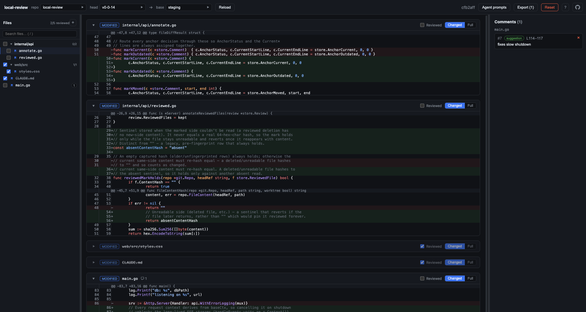

<div align="center">

# local-review

**Review a git branch locally, leave line-level comments, and hand the result to your coding agent as clean markdown.**

[](https://github.com/rosenbjerg/local-review/releases/latest)
[](https://github.com/rosenbjerg/local-review/actions/workflows/ci.yml)
[](go.mod)
[](LICENSE)

</div>

local-review gives you GitHub-style review ergonomics for a branch you haven't
pushed — or don't want to push — entirely on your machine. Point it at a folder
of git repos, pick a branch, and review the diff it introduces: comment on any
line or range, reply in threads, resolve what's done, mark files reviewed. Then
**export the review as markdown** — file path, line(s), code snippet, and your
comment — to paste straight into a coding agent. The agent can even reply to
your comments through the API, and its replies show up live in the UI.

It ships as a **single binary**: a Go backend with the React frontend embedded,
no runtime dependencies beyond `git`.

<p align="center">
  
  <br>
  <em>Reviewing a branch diff with inline comments, ready to export to a coding agent.</em>
</p>

## Highlights

- **Branch-scoped diff.** Reviews what a branch introduces (diff against the
  merge-base with `main`/`master`), with a full-file / changed-only toggle.
- **Comment anywhere.** Any line or dragged range, on changed or unchanged
  lines. Threads with replies, a type per comment (bug / suggestion / question /
  nit), and resolvable threads that drop out of the export.
- **Drift-resistant anchors.** Comments capture the code they point at and track
  it as the branch moves — precise git line-mapping where possible, snippet
  matching otherwise — badging threads that *moved* or went *outdated*.
- **Reviewed-file tracking** that un-checks a file automatically when its content
  changes after you reviewed it.
- **Agent handoff, two ways.** Point an agent at the review's API to pull the
  feedback and reply itself, or export the markdown to paste in directly —
  [details below](#the-agent-handoff-loop).
- **Live multi-tab sync** over SSE — comments and reviewed state stay in sync
  across browser tabs.
- **Renders every file, stays fast.** Syntax highlighting for ~235 languages,
  before/after previews for images, and a text/image toggle for SVGs — with lazy
  rendering so large change-sets stay responsive.

## Install

### Download a prebuilt binary

Grab the latest from [**Releases**](https://github.com/rosenbjerg/local-review/releases/latest):

| Platform | Asset |
|----------|-------|
| macOS (Apple Silicon) | `local-review-darwin-arm64` |
| macOS (Intel) | `local-review-darwin-amd64` |
| Linux (x86-64) | `local-review-linux-amd64` |
| Linux (ARM64) | `local-review-linux-arm64` |
| Windows (x86-64) | `local-review-windows-amd64.exe` |

On macOS/Linux, make it executable — and on macOS clear the download quarantine:

```sh
chmod +x local-review-darwin-arm64
xattr -d com.apple.quarantine local-review-darwin-arm64   # macOS only
```

### Install with mise

[mise](https://mise.jdx.dev) installs local-review straight from the GitHub
releases, picking the binary that matches your OS and architecture:

```sh
mise use -g github:rosenbjerg/local-review
```

Or pin it in a project's `mise.toml`:

```toml
[tools]
"github:rosenbjerg/local-review" = "latest"
```

### Build from source

Requires Go (see [`go.mod`](go.mod)) and Node.js 22+. The frontend must be built
before the binary — it's embedded via `go:embed`:

```sh
npm --prefix web install
npm --prefix web run build        # → web/dist (embedded)
go build -o local-review .
```

Or use the one-shot script, which builds everything and starts the server:

```sh
./start.sh <folder-of-git-repos>
```

## Usage

```sh
./local-review -root /path/to/folder-of-repos
```

It opens `http://127.0.0.1:7777` in your browser. From there:

1. **Pick a repository** — any git repo directly under `-root`.
2. **Pick a head branch.** The base defaults to the merge-base with
   `main`/`master`; override it with an explicit ref if you want.
3. **Review the diff.** Click a line number or drag across a range to comment.
   Reply in threads, set a type, resolve threads, and mark files reviewed as you
   go.
4. **Export.** Preview the markdown, then copy or download it.

State lives in a SQLite database under `~/.local-review/` (override with
`-data-dir`), keyed by repo path — so one install serves many repos and resumes
each review independently. Draft reviews older than `-retention-days` (default
30) are pruned on startup.

### The agent handoff loop

The review is a markdown artifact — each comment as a file path, line(s),
captured snippet, and your note, grouped by file, with resolved threads excluded
so the agent only sees open, actionable feedback. There are two ways to get it
to a coding agent:

- **Copy agent instructions** (toolbar) — copies a short prompt that points the
  agent at *this review's* API. The agent pulls the review itself
  (`POST /api/reviews/{id}/export`, reading the `markdown` field) and replies to
  comments by id. Best for iterating: after you add or change comments, the agent
  just re-fetches the latest — no re-paste.
- **Export** (modal) — preview, then copy or download the rendered markdown to
  paste in directly. Optionally include **reply instructions**, a `curl` example
  so a paste-only agent can still post replies.

Either way the agent posts replies back to each comment
(`POST /api/comments/{id}/replies`), and they appear **live in the UI** — read
them, resolve what's addressed, and hand off what's left with one more fetch.

### Flags

| Flag | Default | Purpose |
|------|---------|---------|
| `-root` | `.` | Folder containing one or more git repositories |
| `-port` | `7777` | Listen port |
| `-data-dir` | `~/.local-review` | Directory for the SQLite DB |
| `-retention-days` | `30` | Prune draft reviews older than this on startup |
| `-no-open` | `false` | Don't auto-open the browser |

## How it works

A single Go binary serves a JSON API and the embedded React app, reading git by
shelling out to the real `git` binary and storing review state in SQLite (the
backend is the source of truth; the frontend is a cache over it). Comments anchor
to the new side and stay drift-resistant; staleness and reviewed-state are
*derived* on every read rather than trusted from a stored flag.

For the full design rationale see [SPEC.md](SPEC.md); for a map of the codebase
and the architecture notes see [CLAUDE.md](CLAUDE.md).

## Develop

Run the Go server and the Vite dev server side by side — Vite proxies `/api` to
`:7777`:

```sh
./local-review -root /path/to/folder-of-repos -no-open   # terminal 1
npm --prefix web run dev                                 # terminal 2 → :5173
```

See [CONTRIBUTING.md](CONTRIBUTING.md) for the build order, checks, and
conventions.

## Contributing & security

- Contributions welcome — start with [CONTRIBUTING.md](CONTRIBUTING.md).
- To report a vulnerability, see [SECURITY.md](SECURITY.md) (please don't open a
  public issue).

## License

[GPL-3.0](LICENSE) © Malte Rosenbjerg.
