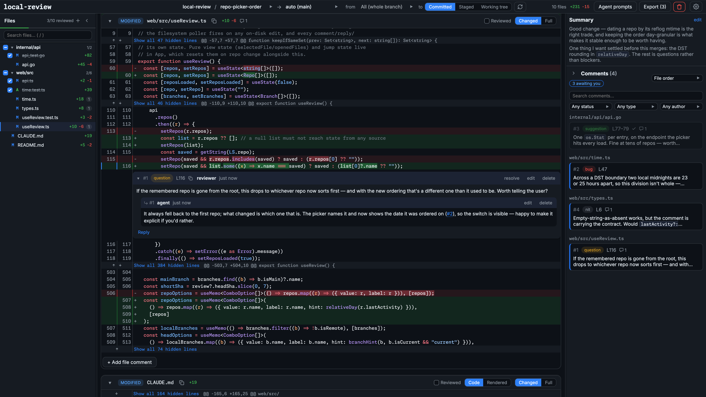

<div align="center">

# local-review

**Review a git branch locally, leave line-level comments, and hand the result to your coding agent as clean markdown.**

[](https://github.com/rosenbjerg/local-review/releases/latest)
[](https://github.com/rosenbjerg/local-review/actions/workflows/ci.yml)
[](go.mod)
[](LICENSE)

</div>

local-review gives you GitHub-style review ergonomics for a branch you haven't
pushed — or don't want to push — entirely on your machine. Point it at a folder
of git repos, pick a branch, and review the diff it introduces (or just the work
sitting uncommitted in your tree): comment on any line or range, reply in threads,
resolve what's done, mark files reviewed. Then **export the review as markdown** —
file path, line(s), code snippet, and your comment — to paste straight into a
coding agent. The agent can even reply to your comments through the API, and its
replies show up live in the UI.

It ships as a **single binary**: a Go backend with the React frontend embedded,
no runtime dependencies beyond `git`.

<p align="center">
  
  <br>
  <em>Reviewing a branch diff, ready to export to a coding agent.</em>
</p>

## Highlights

- **Branch-scoped diff, narrowable.** Reviews what a branch introduces (diff
  against the merge-base with `main`/`master`), with a full-file / changed-only
  toggle. Narrow it with the **from** picker to start at one of the branch's own
  commits — that commit's own changes included — or tick **uncommitted** to review
  your working tree, and untick **unstaged** to review only what's staged. The
  toolbar shows the changed-file count and names both ends of the comparison, so
  what you're looking at is never a guess.
- **A review summary.** A free-text note above the comments pane that leads the
  export — the framing a list of line comments can't carry on its own.
- **Comment anywhere.** Any line or dragged range, on changed or unchanged lines,
  and on files the branch never touched. Threads with replies, a type per comment
  (bug / suggestion / question / nit), `#id` cross-references between threads, and
  resolvable threads that drop out of the export.
- **Drift-resistant anchors.** Comments capture the code they point at and track
  it as the branch moves — precise git line-mapping where possible, snippet
  matching otherwise — following renames and badging threads that *moved* or went
  *outdated*.
- **Reviewed-file tracking** that un-checks a file automatically when its content
  changes after you reviewed it.
- **Agent handoff, two ways.** Hand a coding agent the review to address, or send
  an agent to review the branch itself and file its findings next to yours —
  [details below](#the-agent-handoff-loop).
- **Live sync.** SSE keeps every tab current, and a filesystem watcher catches
  work done outside the UI — an agent's edits and new commits show up without a
  reload.
- **Word-level diffs.** A changed line shades just the words that changed, so a
  one-character edit doesn't read as a line rewritten.
- **Renders every file, stays fast.** Syntax highlighting for ~235 languages,
  rendered markdown (mermaid diagrams included), before/after previews for images,
  and a text/image toggle for SVGs — with lazy rendering so large change-sets stay
  responsive.
- **Keyboard-driven.** `j`/`k` between files, `n`/`p` between comments, `v` to mark
  a file reviewed and jump to the next one still unread, `/` to search files, `?`
  for the full list. Select a word to light up its other
  occurrences in the file and step through them with `Enter`.

## Install

### Download a prebuilt binary

Grab the latest from [**Releases**](https://github.com/rosenbjerg/local-review/releases/latest):

| Platform | Asset |
|----------|-------|
| macOS (Apple Silicon) | `local-review-darwin-arm64` |
| macOS (Intel) | `local-review-darwin-amd64` |
| Linux (x86-64) | `local-review-linux-amd64` |
| Linux (ARM64) | `local-review-linux-arm64` |
| Windows (x86-64) | `local-review-windows-amd64.exe` |

On macOS/Linux, make it executable — and on macOS clear the download quarantine:

```sh
chmod +x local-review-darwin-arm64
xattr -d com.apple.quarantine local-review-darwin-arm64   # macOS only
```

### Install with mise

[mise](https://mise.jdx.dev) installs local-review straight from the GitHub
releases, picking the binary that matches your OS and architecture:

```sh
mise use -g github:rosenbjerg/local-review
```

Or pin it in a project's `mise.toml`:

```toml
[tools]
"github:rosenbjerg/local-review" = "latest"
```

### Build from source

Requires Go (see [`go.mod`](go.mod)) and Node.js 22+. The frontend must be built
before the binary — it's embedded via `go:embed`:

```sh
npm --prefix web install
npm --prefix web run build        # → web/dist (embedded)
go build -o local-review .
```

Or use the one-shot script, which builds everything and starts the server:

```sh
./start.sh <folder-of-git-repos>
```

## Usage

```sh
./local-review -root /path/to/folder-of-repos
```

It opens `http://127.0.0.1:7777` in your browser. From there:

1. **Pick a repository** — any git repo directly under `-root`.
2. **Pick a head branch.** The base defaults to your trunk — a local
   `main`/`master`, else the remote's default branch — and the diff runs from its
   merge-base with head. Override it with an explicit ref if you want.
3. **Narrow the diff** (optional). Move the *from* side to one of the branch's own
   commits with the **from** picker — the diff then *starts at* that commit, so its
   own changes are part of what you review (picking the branch's oldest commit is
   the same as **All**). Or move the *to* side off the branch head with
   **uncommitted** (available while you have that branch checked out) to review
   your working tree — plus **unstaged** to pick the tree or, unticked, only
   what's staged. These are view options, not part of the review: comments and
   reviewed marks persist as you switch between them. The **uncommitted**/
   **unstaged** choice is remembered per repository. Hover the file count in the
   toolbar to see exactly which two ends are being compared — handy when the count
   differs from your git client, which usually compares against `HEAD` rather than
   the branch's merge-base.
4. **Review the diff.** Click a line number or drag across a range to comment.
   Reply in threads, set a type, resolve threads, and mark files reviewed as you
   go. Press `?` for the keyboard shortcuts.
5. **Export.** Preview the markdown, then copy or download it.

State lives in a SQLite database under `~/.local-review/` (override with
`-data-dir`), keyed by repo path — so one install serves many repos and resumes
each review independently. Draft reviews older than `-retention-days` (default
30) are pruned on startup.

### The agent handoff loop

The review is a markdown artifact — your summary up top, then each comment as a
file path, line(s), captured snippet, and your note, grouped by file, with
resolved threads excluded so the agent only sees open, actionable feedback. **Agent prompts** (toolbar)
opens two copyable prompts, one per direction:

- **Address the review** — points a coding agent at *this review's* API. The agent
  pulls the review itself (`POST /api/reviews/{id}/export`, reading the `markdown`
  field) and replies to comments by id. Best for iterating: after you add or
  change comments, the agent just re-fetches the latest — no re-paste.
- **Do a review** — points an agent at the branch to review it adversarially and
  file what it finds as comments through the API, tagged `review-agent` so its
  findings stay distinct from yours and from the agent addressing them. It reads
  back only its own threads
  (`GET /api/reviews/{id}/comments?author=review-agent`) to follow up on your
  replies.

Both are **editable**, and **Save** keeps your version for that repo — house rules
for what an agent should look for, the test command to run, conventions to respect.
**Reset** restores the built-in one. The two prompts are edited, saved and reset
independently. The review-specific values stay as placeholders (`{{origin}}`,
`{{reviewId}}`, `{{headRef}}`, `{{baseRef}}`) that are filled in when you copy, so a
saved prompt keeps working on the next review rather than naming the one you edited it
against.

Prefer to paste? **Export** (modal) previews the rendered markdown, then copies or
downloads it — optionally with **agent reply instructions**, a `curl` example so
a paste-only agent can still post replies.

Either way the agent posts replies back to each comment
(`POST /api/comments/{id}/replies`), and they appear **live in the UI** — read
them, resolve what's addressed, and hand off what's left with one more fetch.

Two more endpoints exist for scripting the loop rather than participating in it:
`GET /api/reviews` lists every stored review (id, repo, base/head, status) so a
script can find the one it wants without being handed an id, and
`DELETE /api/reviews/{id}` discards one outright — comments, replies and reviewed
marks with it. There is no undo, and the UI offers no button for it; use
**Reset** (which keeps the review and clears its contents) unless you really mean
to remove the row.

Once a review is a conversation, the comments pane keeps your side of it: a
thread whose latest word is the agent's is marked as **awaiting you**, the header
counts how many, and clicking that count filters the pane down to them — which
also narrows what `n`/`p` step through, so you can walk the replies and nothing
else.

### Flags

| Flag | Default | Purpose |
|------|---------|---------|
| `-root` | `.` | Folder containing one or more git repositories |
| `-port` | `7777` | Listen port |
| `-data-dir` | `~/.local-review` | Directory for the SQLite DB |
| `-retention-days` | `30` | Prune draft reviews older than this on startup |
| `-no-open` | `false` | Don't auto-open the browser |

## How it works

A single Go binary serves a JSON API and the embedded React app, reading git by
shelling out to the real `git` binary and storing review state in SQLite (the
backend is the source of truth; the frontend is a cache over it). Comments anchor
to the new side and stay drift-resistant; staleness and reviewed-state are
*derived* on every read rather than trusted from a stored flag. Open tabs hold an
SSE stream and refetch on a ping, and while anyone is watching a review the server
fingerprints the repo on a timer — so changes made outside the UI reach the screen
on their own.

For the full design rationale see [SPEC.md](SPEC.md); for a map of the codebase
and the architecture notes see [CLAUDE.md](CLAUDE.md).

## Develop

Run the Go server and the Vite dev server side by side — Vite proxies `/api` to
`:7777`:

```sh
./local-review -root /path/to/folder-of-repos -no-open   # terminal 1
npm --prefix web run dev                                 # terminal 2 → :5173
```

See [CONTRIBUTING.md](CONTRIBUTING.md) for the build order, checks, and
conventions.

## Contributing & security

- Contributions welcome — start with [CONTRIBUTING.md](CONTRIBUTING.md).
- To report a vulnerability, see [SECURITY.md](SECURITY.md) (please don't open a
  public issue).

## License

[GPL-3.0](LICENSE) © Malte Rosenbjerg.
